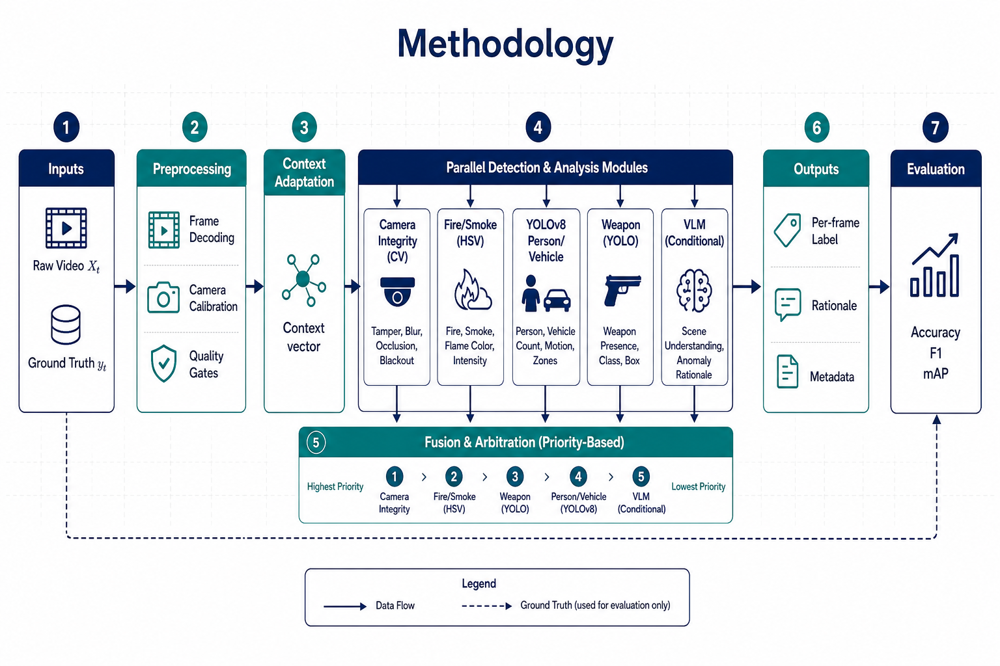
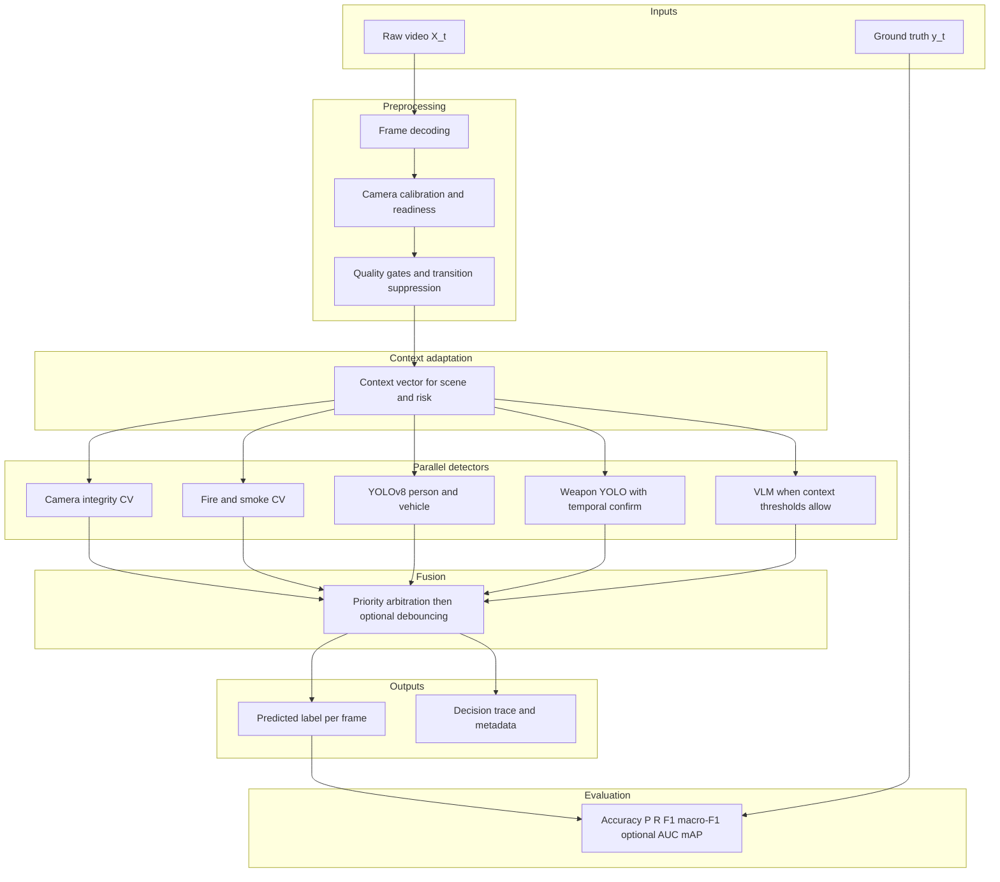

# Priority-Gated Camera Integrity and Context-Aware Semantic Anomaly Detection

Research code release for **hybrid risk simulation**, **frame-level anomaly benchmarks**, and evaluation utilities accompanying work submitted to *Computer Vision and Image Understanding* (CVIU). This repository is a **slim, reproducibility-focused** snapshot: the full offline demo GUI, VLM service layer, and live-engine orchestration are **not** included here.

**Public repository:** [github.com/tayyabrehman96/CVIU_Priority-Gated-Camera-Integrity-and-Context-Aware-Semantic-Anomaly-Detection-Framework-](https://github.com/tayyabrehman96/CVIU_Priority-Gated-Camera-Integrity-and-Context-Aware-Semantic-Anomaly-Detection-Framework-)

## At a glance (simple workflow)

For readers who only need a **minimal story**—not every package and knob—the path is:

1. **Get the code** and install Python dependencies (details are in **Reproduction** only if you actually run experiments).
2. **Add video clips** you are allowed to use into `videos/` (or generate synthetic test clips with one script).
3. **Build a scenario folder** that lists which clip is which event type (one command).
4. **Score how well the detectors match those labels** (another command). Results land in `reports/` as tables you can open in Excel or similar.
5. Compare against **public benchmarks** (see **Data availability**) when you position results in a paper—not inside this repo.

Anything about torch, YOLO weights, `config.py`, or “metadata-only” is **optional complexity**; see **Technical deep dive** for what each choice removes or keeps.

## Contribution (summary)

The framework combines **priority-gated** hard guards (camera health, occlusion, blur) with **context-aware** semantic cues (object-centric models and schedule-driven risk). This codebase focuses on:

- **Reproducible scenario packs** under `simulations/` (generated, not committed), mixing dataset-native `TEST_*.mp4` clips with **synthetic risk injections** driven by [`risk_simulation_protocol.json`](risk_simulation_protocol.json).
- **Benchmarking** via [`test_pipeline.py`](test_pipeline.py), which evaluates aligned labels against a defined temporal schedule and reports accuracy, macro-F1, and risk-quality metrics used in the experiment matrix.

## Methodology overview

1. **Hybrid risk simulation** ([`hybrid_risk_simulation.py`](hybrid_risk_simulation.py)) builds a run directory with a `manifest.json` and a `videos/` subfolder. Modes include `dataset_only`, `synthetic_only`, and `hybrid`. Severity (`low` / `high`) and RNG `seed` are controlled from the CLI; temporal structure and scales come from the protocol JSON.
2. **Experiment matrix** ([`run_experiment_matrix.py`](run_experiment_matrix.py)) runs the simulation grid (modes × severities × seeds), invokes `test_pipeline.run_benchmark` on each pack, and writes timestamped CSV summaries under `reports/`. [`aggregate_experiment_matrix.py`](aggregate_experiment_matrix.py) aggregates multiple runs; [`run_experiment_cell.py`](run_experiment_cell.py) runs a single cell.
3. **Detection stack in this repo** Minimal [`core/guards.py`](core/guards.py) implements CV-based fire/smoke, occlusion/cover, blur/block heuristics, and related helpers; tunables load from a local **`config.py`** you create by copying [`config.example.py`](config.example.py). Optional **Ultralytics YOLOv8** paths are used inside [`test_pipeline.py`](test_pipeline.py) for full-model evaluation.

## Methodology diagram

Pipeline: **inputs** → **preprocessing** → **context adaptation** → **parallel detectors** → **fusion and arbitration** → **per-frame outputs** → **evaluation** (compare predictions to ground truth). The schematic below matches the manuscript overview (camera integrity, fire or smoke, YOLO auxiliary, weapon branch, conditional VLM, priority fusion, debouncing, metrics).



*Overview figure for the repository README. Replace [`docs/methodology_diagram.png`](docs/methodology_diagram.png) with your manuscript artwork if you need a pixel-identical match.*



## Data availability

Public benchmarks used for **protocol alignment** and **comparative positioning** (download from the providers; not redistributed here):

| Dataset | URL | Reference |
|---------|-----|-----------|
| **UCF-Crime** | [crcv.ucf.edu/projects/real-world](https://www.crcv.ucf.edu/projects/real-world/) | Sultani et al., 2018 |
| **ShanghaiTech Campus** | [svip-lab.github.io/dataset/campus_dataset.html](https://svip-lab.github.io/dataset/campus_dataset.html) | Georgescu et al., 2021 |
| **UHCTD** (camera tampering + devkit) | [github.com/QuantitativeImagingLaboratory/ctd-devkit](https://github.com/QuantitativeImagingLaboratory/ctd-devkit) | — |

## Data: how to obtain inputs

Large media files are **not** committed (see [`.gitignore`](.gitignore)).

| Source | Role |
|--------|------|
| [`dataset_preparation.ipynb`](dataset_preparation.ipynb) | Curated **public** clip URLs, normalization to 720p H.264, optional frame extraction; extend `VIDEO_SOURCES` as documented in the notebook. |
| [`download_test_videos.ipynb`](download_test_videos.ipynb) | Additional helpers for obtaining baseline surveillance-style footage. |
| [`generate_test_videos.py`](generate_test_videos.py) | Builds **synthetic multi-scene** `TEST_*.mp4` clips under `videos/` from at least one **normal** base file (see `find_source_video()` for expected filenames). |
| Public benchmarks (e.g. UCF-Crime, ShanghaiTech) | Cite and use per your manuscript’s experimental section; this repo does not redistribute those datasets. |

Place normalized or generated clips in [`videos/`](videos/README.md) before running simulations. For **`--metadata-only`** simulation runs, existing `TEST_*.mp4` files are copied into each scenario pack without full re-encoding.

## Models

- **YOLOv8 (general):** download with Ultralytics (see [`models/README.md`](models/README.md)); default checkpoint name `yolov8s.pt` at repo root.
- **Weapon-specialized YOLO:** optional; path from `WEAPON_MODEL_PATH` in your local `config.py` (see [`config.example.py`](config.example.py)). Omit weights or pass `--no-models` where supported for faster, guard-heavy runs.

## Technical deep dive: pipeline, scope, and reducing steps

This section is for reviewers, integrators, and authors who need **precision**. The simple workflow above deliberately hides most of it.

### Full framework vs this repository

The **manuscript-level** system is a multi-stage pipeline: decoding, quality gates, **context adaptation** (a control signal over scene risk), **parallel detectors** (classical camera-integrity CV, fire or smoke heuristics, general YOLO, weapon-specific YOLO, optionally a **VLM** when gating thresholds fire), then **priority fusion**, optional **temporal debouncing**, and finally **evaluation** against frame or clip labels.

**This GitHub snapshot is intentionally reduced.** It does **not** ship the live GUI, the NVR or ONVIF ingest, Redis or export daemons, or the VLM cloud or Ollama client. What remains is the part needed to **rebuild scenario packs**, run **deterministic benchmarks**, and inspect **CSV metrics**. That is a deliberate scope cut: fewer moving parts, reproducible numbers, no API keys in the default path.

### Data and control flow (what actually runs)

1. **`hybrid_risk_simulation.py`** reads [`risk_simulation_protocol.json`](risk_simulation_protocol.json) (severity scales, time windows in seconds). Depending on `--mode` (`dataset_only`, `synthetic_only`, `hybrid`), it either reuses existing `TEST_*.mp4` naming conventions, synthesizes stressed variants from “normal” base files, or mixes both. Output is a directory under `simulations/` (gitignored) containing `manifest.json` and a `videos/` subdirectory whose filenames and expected labels the benchmark understands.

2. **`--metadata-only`** does **not** re-encode the world: it **copies** existing labeled clips into the pack. That cuts **heavy I/O and CPU or GPU** use for building packs, at the cost of not stress-testing compression or injection code paths.

3. **`test_pipeline.py`** decodes each clip, walks frames with a stride (`--sample-frames` or matrix default), and for each frame calls **`classify_frame`**, which implements a **fixed arbitration order**: hard guards first (block, cover, occlusion, blur), then classical fire or smoke CV, then—if models are loaded—YOLO for generic objects and weapon logic, then theft or suspect heuristics tied to person plus weapon overlap, else benign. Ground truth comes from the manifest schedule and filename-to-label maps inside the script. Metrics aggregate confusion-style counts into accuracy, macro-F1, and auxiliary “risk quality” scalars used by the matrix scripts.

4. **`run_experiment_matrix.py`** is a **Cartesian driver**: modes × severities × seeds, each time spawning simulation then benchmark. **`run_experiment_cell.py`** is the same for one tuple. **`aggregate_experiment_matrix.py`** rolls multiple CSVs forward with bootstrap CIs where implemented.

Nothing in the remaining code calls a language model; any “VLM” or “Regolo” behavior in the paper is **out of scope** for this tree unless you merge your own service layer back in.

### How to reduce steps (and what you lose)

| Reduction | What you skip | Trade-off |
|-----------|----------------|-----------|
| **`--metadata-only`** on simulation | Pixel-level synthetic risk injection | Faster, disk-friendly; you still need real `TEST_*.mp4` files present. |
| **`--no-models`** on benchmark or matrix | YOLO general and weapon weights | **Weapon**, **theft suspect**, and many **person or vehicle**-driven cues drop to absent or degraded; integrity and fire or smoke CV still run. Macro-F1 across all labels may look worse or collapse for weapon-heavy ground truth. |
| **Larger `--sample-frames` (fewer frames)** | Compute | Coarser time resolution; rare events may be missed; metrics are still “valid” but noisier. |
| **Single `run_experiment_cell.py`** instead of full matrix | Full grid | One scenario only; no cross-seed variance picture. |
| **No `config.py` copy** | Broken import | **Required** for any run: `config.example.py` → `config.py` is the one step you cannot skip in code terms. |
| **Omit public benchmark downloads** | External alignment | Fine for internal ablations; weak for claims that cite UCF-Crime, ShanghaiTech, or UHCTD without actually running those protocols elsewhere. |

### What is “technically required” vs optional (for this repo)

**Hard requirements to execute code paths:** Python 3.10+, OpenCV, NumPy, a **`config.py`** derived from the example, and video inputs consistent with manifest expectations.

**Soft requirements for *full* parity with the paper’s detector mix:** PyTorch + Ultralytics, `yolov8s.pt`, and optionally a custom weapon checkpoint under `models/`. Without them you are running a **guard-heavy subset**, which is still publishable for ablations if you state it clearly.

**Not required here:** GPU (CPU torch is fine for small clips), remote APIs, Redis, LaTeX, or the methodology PNG source.

### Where thresholds live

Operational constants (HSV fire bands, blur heuristics, weapon area fractions, YOLO confidence floors) are centralized in **`config.py`** so `core/guards.py` and `test_pipeline.py` stay synchronized. Changing behavior without editing code means editing those values or env overrides that `config.example.py` documents.

## Reproduction

**1. Environment**

```bash
python -m venv .venv
# Windows PowerShell:
.\.venv\Scripts\Activate.ps1
# Linux/macOS:
# source .venv/bin/activate

# Create local config (required once per clone)
# Windows PowerShell: Copy-Item config.example.py config.py
# bash: cp config.example.py config.py

pip install torch torchvision torchaudio --index-url https://download.pytorch.org/whl/cpu
pip install -r requirements.txt
```

**2. Weights** — follow [`models/README.md`](models/README.md).

**3. Videos** — populate `videos/` (see **Data** above).

**4. Single simulation pack (example, metadata-only)**

```bash
python hybrid_risk_simulation.py --mode hybrid --severity high --seed 37 --metadata-only
```

**5. Full experiment matrix**

```bash
python run_experiment_matrix.py --sample-frames 5 --out-dir reports
```

Committed **CSV** exports under [`reports/`](reports/) (`risk_matrix_*.csv`, `detections_*.csv`, `frame_log_*.csv`, `video_summary_*.csv`, etc.) record dataset-derived experiment outputs. Regenerating runs still writes new files alongside them; large scratch `.txt` logs remain untracked.

Use `--no-models` on `run_experiment_matrix.py` / `test_pipeline.py` if you want to skip YOLO loading.

**6. Optional analysis**

```bash
python eval_resample_imbalance.py --help
```

## Repository layout

```
├── config.example.py              # Template → copy to config.py (gitignored)
├── core/
│   └── guards.py                  # CV guards & fire/smoke heuristics (minimal core)
├── hybrid_risk_simulation.py      # Scenario pack builder
├── risk_simulation_protocol.json  # Severities and temporal schedule
├── run_experiment_matrix.py      # Full grid + benchmark
├── run_experiment_cell.py        # Single grid cell
├── aggregate_experiment_matrix.py
├── test_pipeline.py               # Benchmark driver
├── eval_resample_imbalance.py
├── generate_test_videos.py       # Synthetic TEST_* clips for benchmarks
├── dataset_preparation.ipynb
├── download_test_videos.ipynb
├── docs/                          # methodology_diagram.png + docs/README.md
├── Images/                        # Local extras gitignored; methodology figure lives under docs/
├── reports/                       # *.csv experiment outputs (tracked)
├── models/README.md
├── videos/README.md
├── requirements.txt
└── LICENSE
```

## Citation

If you use this code, please cite the **CVIU manuscript** once it is available, and the **code repository**:

```bibtex
@software{rehman2026cviu_priority_gated_code,
  author       = {Rehman, Tayyab},
  title        = {{Priority-Gated Camera Integrity and Context-Aware Semantic Anomaly Detection}: research code},
  year         = {2026},
  url          = {https://github.com/tayyabrehman96/CVIU_Priority-Gated-Camera-Integrity-and-Context-Aware-Semantic-Anomaly-Detection-Framework-},
  note         = {Supplemental implementation; add the journal \texttt{@article} with DOI when published.}
}
```

Related survey and VAD literature for related work is cited in the CVIU manuscript (bib entries were maintained in a local `cas-refs.bib` — not distributed with this repository).

## License

Released under the [MIT License](LICENSE).
